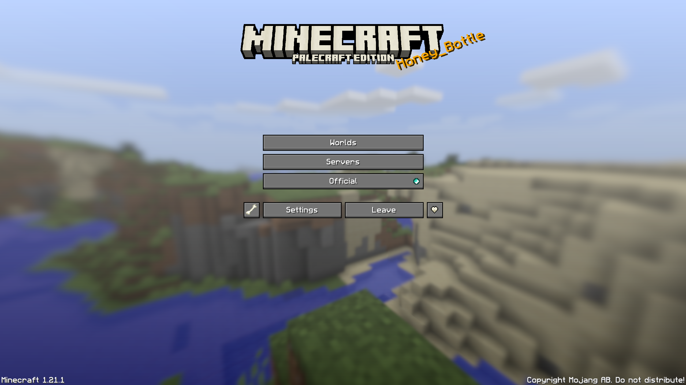
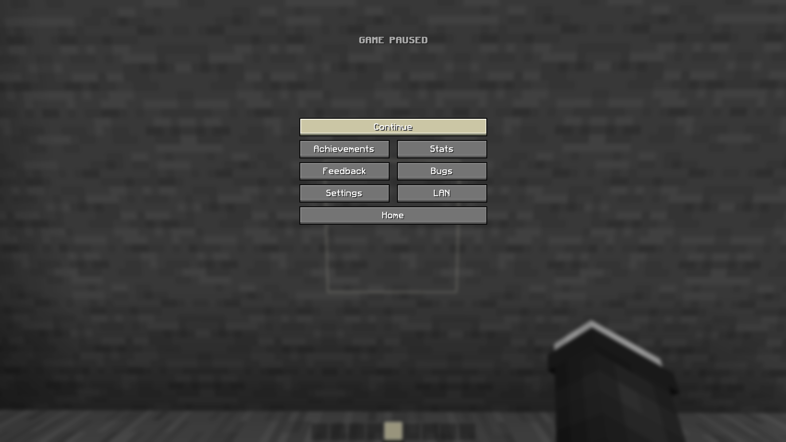
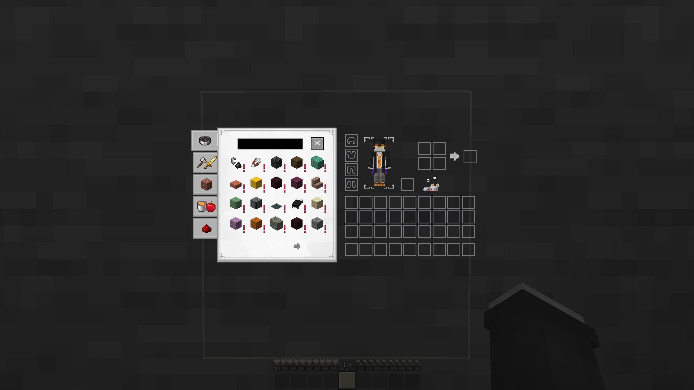
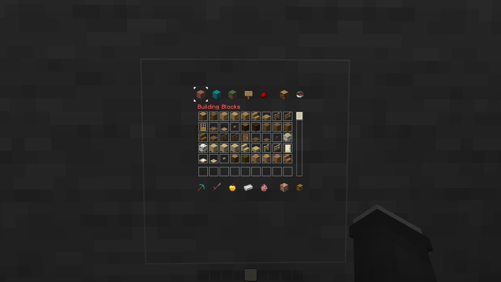
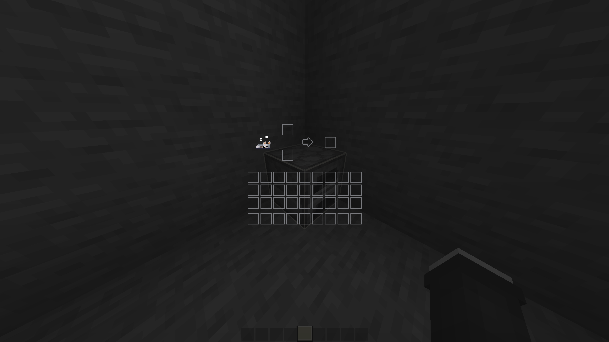
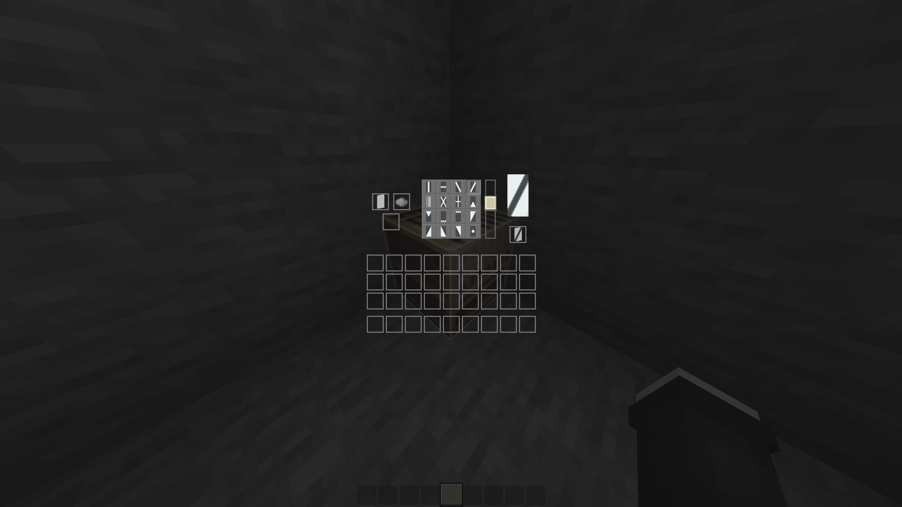

# A Minecraft Texturepack
PaleCraft is inspired by the bone texture and is a Black & White styled texturepack. Most textures are still vanilla, only the ore blocks and some items are updated. I changed some coreshaders for better block and hitbox outlines and a custom XP-Number color.

## Get the Texturepack
1. Go to [Releases](https://github.com/Justifull/PaleCraft/releases/latest)
2. Download the latest `PaleCraft-X.XX.X.zip` file
3. Paste the file into your `resourcepacks` folder

## Previews

   
Main Menu

   

   
Pause Screen

   

   
Survival GUIs

   
   
   

   
Creative GUIs

   
   

   
Other GUIs

   
   
   
   
   

   
Blocks

   

