PaleCraft is inspired by the bone texture and is a Black & White styled<span style="display: inline;"> </span>

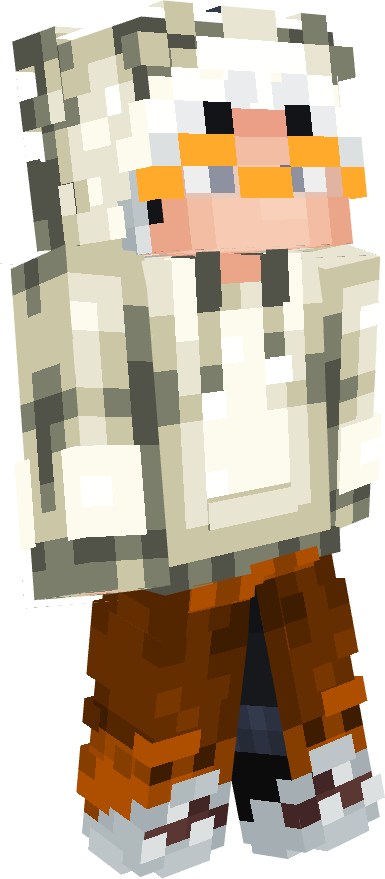

<div style="margin-top: -20px">
   texturepack. Most textures are still vanilla, only the
</div>
<div style="margin-left: 210px">
   ore blocks and some items are updated. I changed
</div>
<div style="margin-left: 220px">
    some coreshaders for better block and hitbox outlines.
</div>
<div style="margin-left: 220px; margin-bottom: 350px">
   and a custom XP-Number color.
</div>

<div style="text-align: center;">
    <a href="https://modrinth.com/resourcepack/palecraft" target="_blank" style="display: inline-block; position: relative;">
        
        <span style="visibility: hidden; font-size: 14px; font-weight: 600; color: #fff; position: absolute; z-index: 1; bottom: 90%; left: 50%; transform: translateX(-50%); opacity: 0; transition: opacity 0.3s; white-space: normal; line-height: 1.2;">Modrinth</span>
    </a>
    <style>
        a:hover img {
            filter: brightness(140%);
            transform: scale(1.2);
        }
        a:hover span {
            visibility: visible;
            opacity: 1;
        }
    </style>
</div>


<br>
<p align="center">
   
</p>

<div style="text-align: center; margin-top: -25px">

   _(Not every change included, just sneak peaks)_
</div>

<details>
   <summary>Title Screen</summary>
   <div style="text-align: center">

   Title Screen
   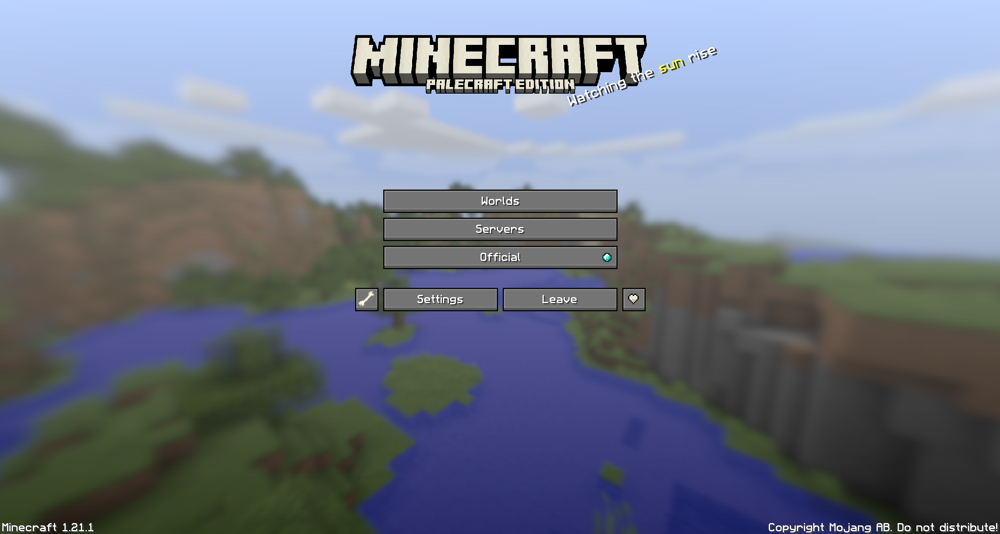

   </div>
</details>
<details>
   <summary>Survival GUIs</summary>
   <div style="text-align: center">

   **Hotbar**
   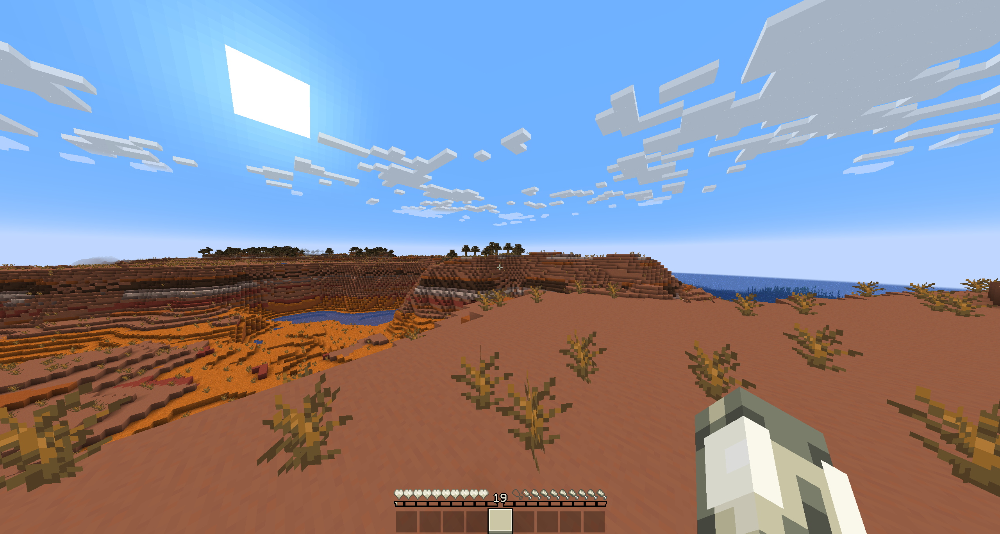
   **Survival Inventory**
   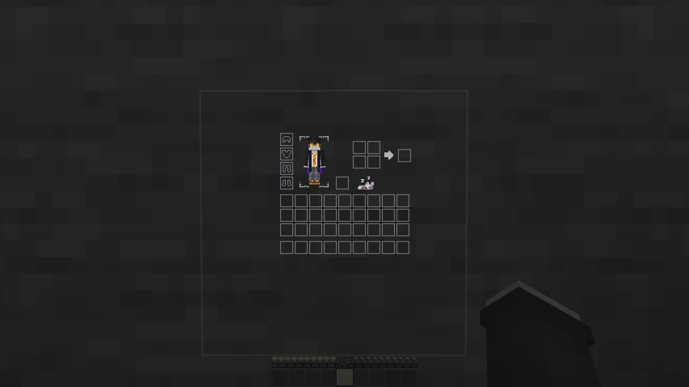

   </div>
</details>
<details>
   <summary>Creative GUIs</summary>
   <div style="text-align: center">

   **Creative Inventory**
   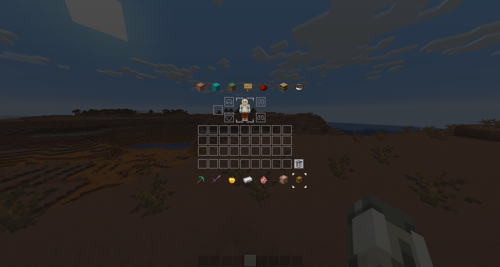

   </div>
</details>
<details>
   <summary>Other GUIs</summary>
   <div style="text-align: center">

   **Crafting Table**
   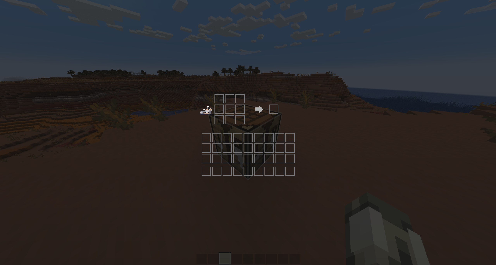
   **Chest**
   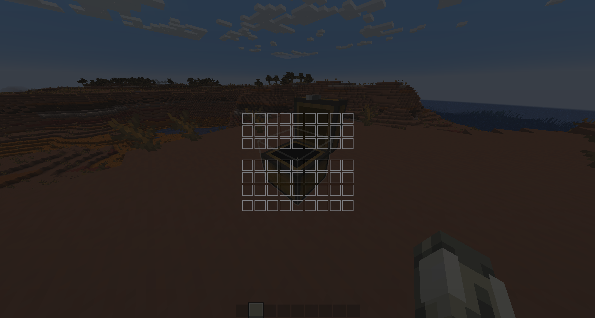
   **Shulker Chest**
   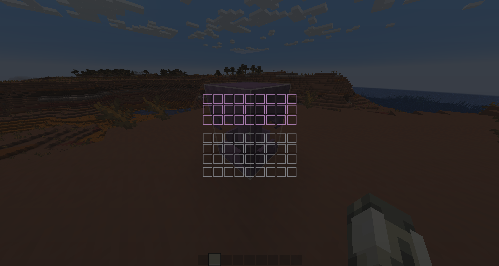
   **Enchanting Table**
   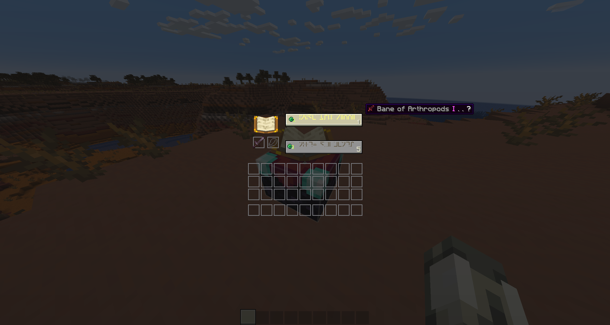
   **Beacon**
   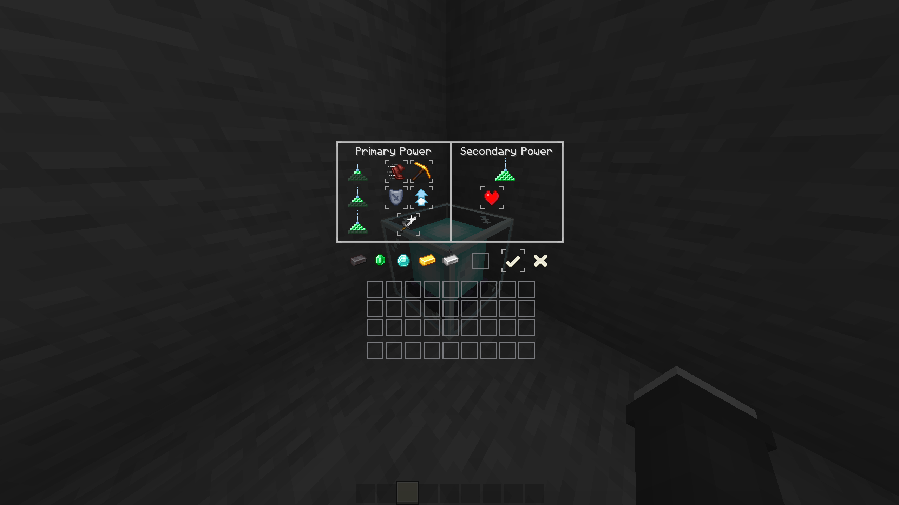

   </div>
</details>
<details>
   <summary>Custom Texts</summary>
   <div style="text-align: center">

   **Enchantment Text Sword**
   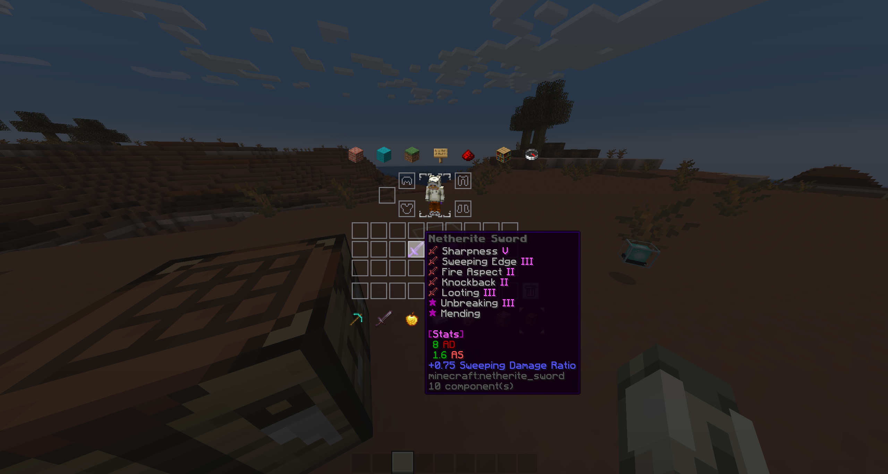
   **Enchantment Text Leggings**
   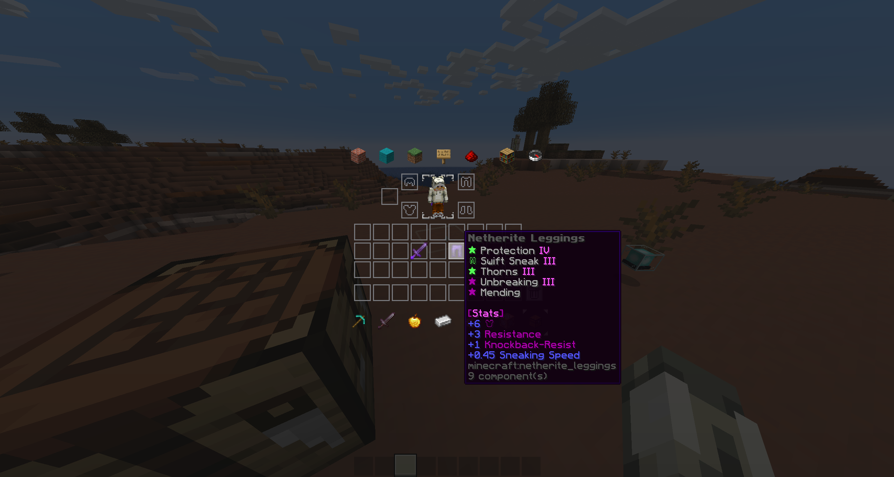

   </div>
</details>
<details>
   <summary>Blocks / Items</summary>
   <div style="text-align: center">

   **Blocks**
   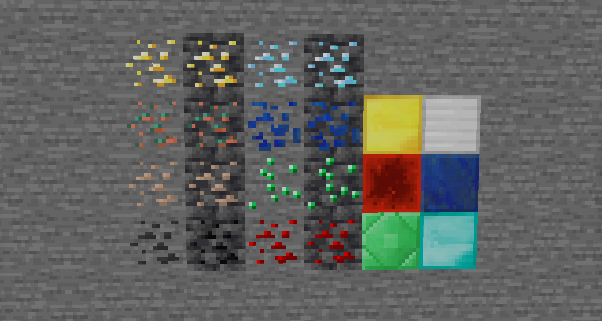
   **Totem Of Undying**
   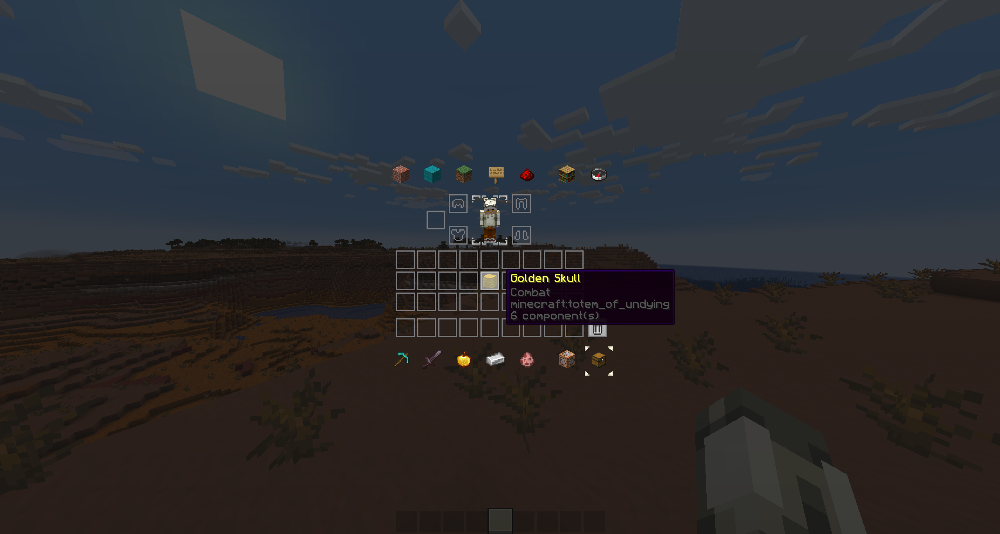
   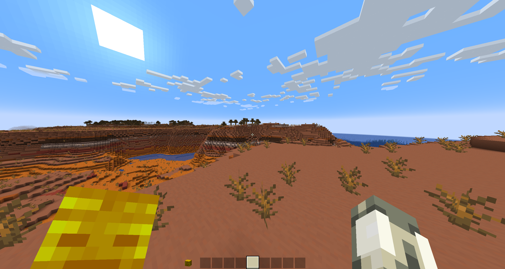

   </div>
</details>

<br>
<br>
<p align="center">
   
</p>

1. Go to [Releases](https://github.com/Justifull/PaleCraft/releases/latest)
2. Download the latest PaleCraft-X.XX.X.zip file
3. Paste the file into your resourcepacks folder

> [!TIP]
> Your resourcepacks folder is located in your Explorer within:
>
> ```bash
> %appdata%
> ```
> and then your .minecraft folder
