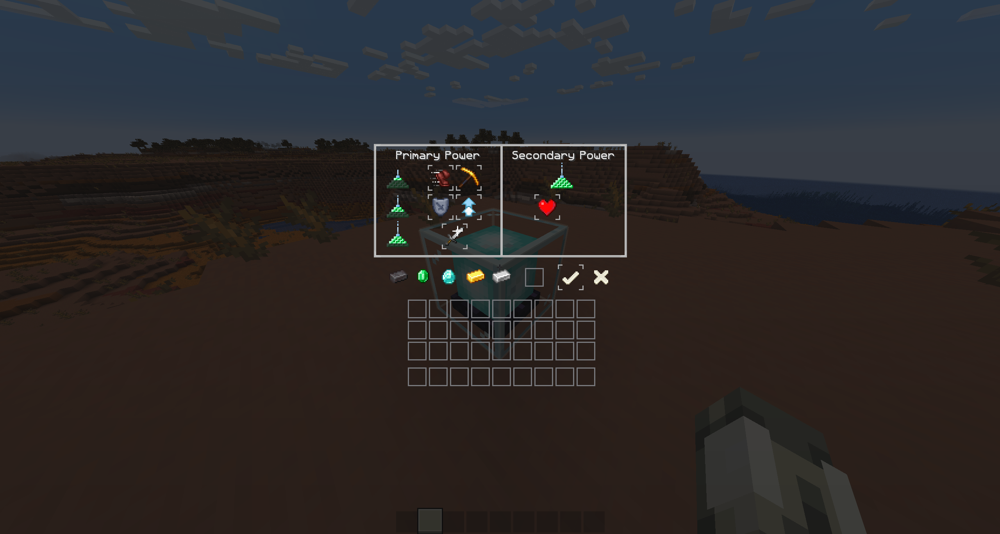

PaleCraft is inspired by the bone texture and is a Black & White styled<span style="display: inline;"> </span>


texturepack. Most textures are still vanilla, only the
ore blocks and some items are updated. I changed
some coreshaders for better block and hitbox outlines.
and a custom XP-Number color.

<br>
<br>
<br>
<br>
<br>
<br>
<br>
<br>
<br>
<br>
<br>
<br>
<br>
<br>
<br>
<br>
<br>
<br>
<br>
<br>
<div align="center">
    <a href="https://modrinth.com/resourcepack/palecraft">
        
    </a>
    &nbsp;&nbsp;&nbsp;&nbsp;&nbsp;
    <a href="https://github.com/Justifull/PaleCraft">
        
    </a>
    &nbsp;&nbsp;&nbsp;&nbsp;&nbsp;
    <a href="https://de.namemc.com/profile/justifull.1">
        
    </a>
</div>

<br>
<br>
<p align="center">
   
</p>

<div style="text-align: center; margin-top: -25px">

   _(Not every change included, just sneak peaks)_
</div>

<details>
   <summary>Title Screen</summary>
   <div style="text-align: center">

   Title Screen
   

   </div>
</details>
<details>
   <summary>Survival GUIs</summary>
   <div style="text-align: center">

   **Hotbar**
   
   **Survival Inventory**
   

   </div>
</details>
<details>
   <summary>Creative GUIs</summary>
   <div style="text-align: center">

   **Creative Inventory**
   

   </div>
</details>
<details>
   <summary>Other GUIs</summary>
   <div style="text-align: center">

   **Crafting Table**
   
   **Chest**
   
   **Shulker Chest**
   
   **Enchanting Table**
   
   **Beacon**
   

   </div>
</details>
<details>
   <summary>Custom Texts</summary>
   <div style="text-align: center">

   **Enchantment Text Sword**
   
   **Enchantment Text Leggings**
   

   </div>
</details>
<details>
   <summary>Blocks / Items</summary>
   <div style="text-align: center">

   **Blocks**
   
   **Totem Of Undying**
   
   

   </div>
</details>

<br>
<br>
<p align="center">
   
</p>

1. Go to [Releases](https://github.com/Justifull/PaleCraft/releases/latest)
2. Download the latest PaleCraft-X.XX.X.zip file
3. Paste the file into your resourcepacks folder

> [!TIP]
> Your `resourcepacks` folder is located in your `Explorer` within:
>
> ```bash
> %appdata%
> ```
> and then your `.minecraft` folder
