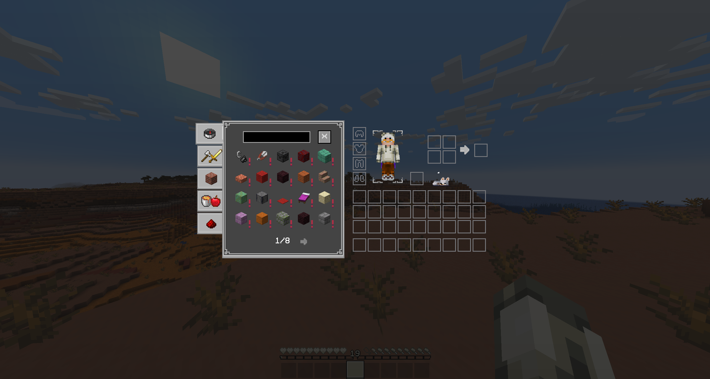

PaleCraft is inspired by the bone texture and is a
Black & White styled texturepack. Most textures are
still vanilla, only the ore blocks and some items
are updated. I changed some coreshaders for better
block and hitbox outlines. and a custom XP-Number
color.

<br>
<br>
<br>
<br>
<br>
<br>
<br>
<br>
<br>
<br>
<br>
<br>
<br>
<br>
<br>
<br>
<br>
<div align="center">
    <a href="https://modrinth.com/resourcepack/palecraft">
        
    </a>
    &nbsp;&nbsp;&nbsp;&nbsp;&nbsp;
    <a href="https://github.com/Justifull/PaleCraft">
        
    </a>
    &nbsp;&nbsp;&nbsp;&nbsp;&nbsp;
    <a href="https://de.namemc.com/profile/justifull.1">
        
    </a>
</div>

<br>
<br>
<p align="center">
   
</p>

<p align="center">
Not every change included, just sneak peaks
</p>

<details>
   <summary>Title Screen</summary>
   <p align="center">
       Title Screen
       
   </p>
</details>
<details>
   <summary>Survival GUIs</summary>
   <p align="center">
       Hotbar
       
       Survival Inventory
       
   </p>
</details>
<details>
   <summary>Creative GUI</summary>
   <p align="center">
       Creative Inventory
       
   </p>
</details>
<details>
   <summary>Other GUIs</summary>
   <p align="center">
       Crafting Table
       
       Chest
       
       Shulker Chest
       
       Enchanting Table
       
       Beacon
       
   </p>
</details>
<details>
   <summary>Custom Texts</summary>
   <p align="center">
       Enchantment Text Sword
       
       Enchantment Text Leggings
       
   </p>
</details>
<details>
   <summary>Blocks / Items</summary>
   <p align="center">
       Blocks
       
       Totem Of Undying
       
       
    </p>
</details>

<br>
<br>
<p align="center">
   
</p>

1. Go to [Releases](https://github.com/Justifull/PaleCraft/releases/latest)
2. Download the latest PaleCraft-X.XX.X.zip file
3. Paste the file into your resourcepacks folder

> [!TIP]
> Your `resourcepacks` folder is located in your `Explorer` within:
>
> ```bash
> %appdata%
> ```
> and then your `.minecraft` folder
